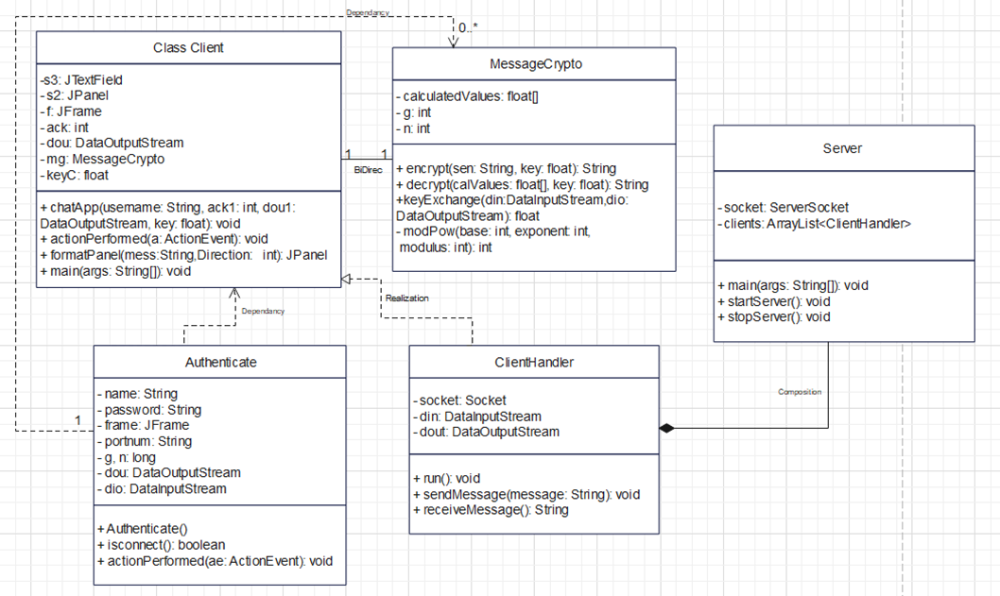
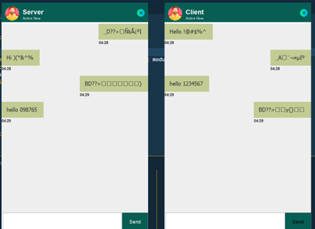

# Lightweight-Encrypted-Chat-App
A new Lightweight encryption algorithm integrated with fast and reliable Chatting application.
The main purpose of this project is to develop a Chat Application using Java as a main working language, where the messages are encrypted and will be stored using Data Structure that is Linked List and the encryption will be by the private key at the transmission end and  will decrypted with the same key at the receiver end on the network using the Lightweight Encryption algorithm, and the exchange of keys will be done by using the technique called Diffie Hellman. 

For launching this Application.
1. You will need to import the required libraries explicitly.
2. For the app to run interuptedly, both machines have to be on the same network.
3. Launch the Server Side first to establish a host machine.
4. A number of clients can now connect to the server and start a broadcast communication channel.

